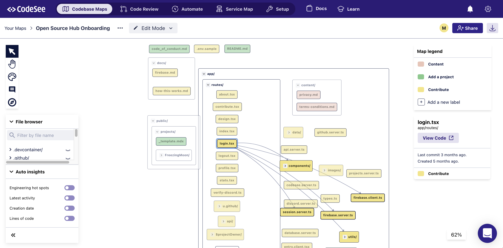

# Open Source Hub

Welcome to Open Source Hub! This website and community connects open source maintainers and collaborators. Please join [our Discord channel](https://discord.gg/opensource) if you have any questions or just want to chat!

[](https://app.codesee.io/maps/public/f5dcb920-ee8f-11ec-a5b3-bb55880b8b59)

## Project setup

**Requirements:**

- Node v14 or above
- Yarn: `npm install --global yarn`

**First-time setup:**

1. check out this repository and navigate into it with `cd opensourcehub`
2. install the dependencies: `yarn`
3. copy the contents of `.env.sample` to a `.env` file

🚀 When you've completed these steps, run the app:

```
yarn dev
```

### github.dev environment

You can also contribute to OSH without having to run the app on your local machine! Go ahead and check out the github.dev steps below.

If you have a JavaScript development environment set up already and prefer to run locally, the approach will be familiar.

1. [Create a fork](https://docs.github.com/en/get-started/quickstart/fork-a-repo) of the OSH.
1. Once on your fork's page, either press the full stop `.` key or replace `.com` in the location bar in your browser to `.dev`.

Now you're in the github.dev editor! Feel free to hop ahead to [our contributing section](#contributing).

For more information on the Github.dev editor, please [see their docs](https://docs.github.com/en/codespaces/the-githubdev-web-based-editor).

### How to list your project

We recommend [listing your project through the website](https://opensourcehub.io/list-project) by using your GitHub account to log in to Open Source Hub.

If you'd prefer to create a pull request manually, you can follow these steps instead:

1. Get the project up and running first
1. Create your project's `.mdx` file:
   1. Create a new folder inside `/public/projects/` and name it the same as your GitHub handle or organization
   1. Add a new `.mdx` file to that folder, and give it the name of your public repo. For example,
      - if your project URl is: `https://github.com/Codesee-io/opensourcehub`
      - you would create: `/public/projects/Codesee-io/opensourcehub.mdx`.
   1. Copy/paste the contents of [`/public/projects/_template.mdx`](https://raw.githubusercontent.com/Codesee-io/opensourcehub/main/public/projects/_template.mdx) into that file
1. Fill out the information — most of it is optional, but extremely helpful for potential contributors. If you opt not to include the optional content, delete it from your template.
1. Add a 200x200 image for your organization to your folder, for example, `./public/projects/distributeaid/da.png`
1. Preview your changes by running `yarn dev`
1. When you're ready, open a PR!

### How to add a CodeSee Map to your project listing

Make it easier for contributors to onboard to your project! With a CodeSee Map, they can visualize the entire codebase, with features allowing them to explore system dependencies, add additional context to pull requests, and more.

To add a Map to your project:

1. Sign up for [CodeSee Maps](https://codesee.io) (there's no commitment or cost!)
1. Create a Map for your repo following [our instructions](https://docs.codesee.io/en/latest/)
1. Set your map to public!
1. Add an entry in your project's template for the Map (see example from Distribute Aid's Shipment Tracker project):

```
featuredMap:
  url: https://app.codesee.io/maps/public/f5dcb920-ee8f-11ec-a5b3-bb55880b8b59
  description: Get a quick overview of the major areas of our repo
```

If you would like to display multiple maps you can add an entry called "maps"

```
maps:
  - url: https://app.codesee.io/maps/public/f5dcb920-ee8f-11ec-a5b3-bb55880b8b59
    description: Get a quick visual overview of the major areas of our repo!
    subTitle: devdocs
  - url: https://app.codesee.io/maps/public/f5dcb920-ee8f-11ec-a5b3-bb55880b8b59
    description: Another map!
    subTitle: testMap
```

That's it!

The CodeSee Map below is a good way to get familiar with the codebase:

[](https://app.codesee.io/maps/public/f5dcb920-ee8f-11ec-a5b3-bb55880b8b59)

## Contributing

First and foremost, all contributors must read and agree to our [code of conduct](https://github.com/Codesee-io/opensourcehub/blob/main/code_of_conduct.md).

Then, the best way to get started is to [create an issue](https://github.com/Codesee-io/opensourcehub/issues) and tag one of the maintainers.

### Technical documentation

- ["How this works"](./docs/how-this-works.md) explains the architecture of this project
- Learn [how we use Firebase](./docs/firebase.md)

## Content

### Moderation policy

Our main goal is to promote meaningful projects to potential contributors, so quality is an important factor in determining which projects are accepted. We do not accept low-quality or spammy contributions. We review repositories and their previous contributions to make our decision. Here are some examples of low-quality submissions:

- Repositories that are only active during events like Hacktoberfest. For example, we will probably reject a repository if all the issues/tasks were created at the start of October.
- Repositories that encourage low-quality contributions, such as arbitrarily curating content or building technology that isn’t intended to be used for anything
- Repositories that offer little to value to the potential contributors. For example, we will probably reject someone’s portfolio website.

These guidelines are subject to change as we tweak our acceptance criteria.

### Tag policy

Final tags are up to the maintainers of Open Source Hub. Your tags may be modified for the benefit of the community and to improve discoverability.

We use title-casing for tags. For example: "First Timer Friendly, Social Activism, C#, JavaScript".

### How to remove your project from Open Source Hub

Open a PR to remove your project folder from this repository.

### Notes

- Please pin the exact version of dependencies
